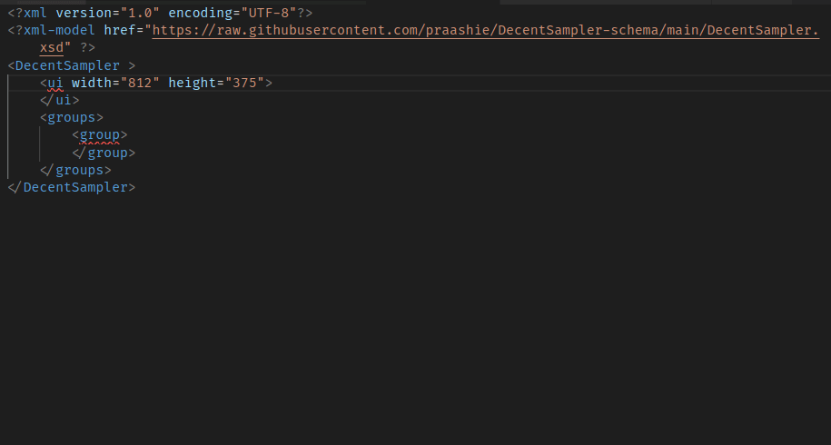
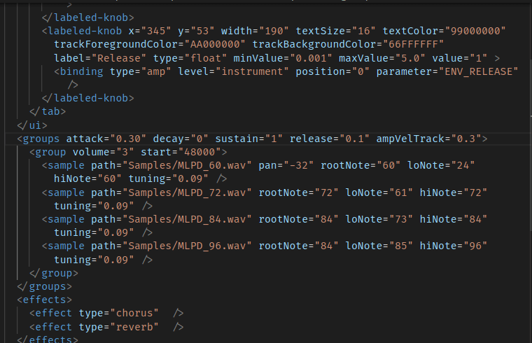

# DecentSampler Unofficial XML schema
## Let's make `.dspreset` editing... **Decent**!

This is an unofficial XML schema for  preset (`.dspreset`) files.

Making virtual instruments for [DecentSampler](https://www.decentsamples.com/product/decent-sampler-plugin/) eventually means some tedious editing of the XML-based `.dspreset` files by hand...

However, if you use a text editor that supports XML schemas, you can **super-charge your editing experience**:

### Use context-aware code completion and suggestions


### See documentation by hovering over a keyword


### Spot errors with tags, attributes, structure, and incorrectly formatted values


## Setup in VS Code

Install [Red Hat's XML editing extension](https://marketplace.visualstudio.com/items?itemName=redhat.vscode-xml).

### Try it out!

Paste the following contents in a new text file:
```xml
<?xml version="1.0" encoding="UTF-8"?>
<?xml-model href="https://raw.githubusercontent.com/praashie/DecentSampler-schema/main/DecentSampler.xsd" ?>
<DecentSampler >
    <ui width="812" height="375">

    </ui>
    <groups>
        <group>
        
        </group>
    </groups>
</DecentSampler>
```
Place your cursor inside the `<group>` tag, and hit <kbd>Ctrl</kbd>+<kbd>Space</kbd> to trigger suggestions!

### Edit an existing `.dspreset` with the schema

You can copy the `<?xml-model ...?>` line inside another `.dspreset` file to activate the schema.
This will also work with some online XML validation tools.

### Associate the schema with all `*.dspreset` files

#### :warning: If you have trouble with this, use the previous section's `xml-model` line as a workaround.

Open your `settings.json` [(instructions here)](https://stackoverflow.com/a/65909052), and copy the following settings inside it:

```json
{
    "xml.fileAssociations": [
        {
            "pattern": "**/*.dspreset",
            "systemId": "https://raw.githubusercontent.com/praashie/DecentSampler-schema/main/DecentSampler.xsd"
        }
    ]
}
```

## A ...*schema*? Huh?

An XML Schema Definition (XSD) is a standard way to describe the expected structure of an XML document.

## Credits

Thanks to David Hilowitz for his exciting DecentSampler project.
This schema has been mostly based on a (quite outdated) document of the DecentSampler file format: https://www.decentsamples.com/wp-content/uploads/2020/06/format-documentation.html

This schema was kickstarted and edited with the VS Code extension [XML by Red Hat](https://marketplace.visualstudio.com/items?itemName=redhat.vscode-xml).
Impressive XSD-based code completion features are the main inspiration for developing this schema in the first place.